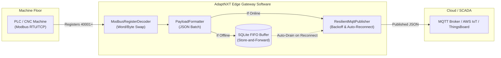

# AdaptNXT Modbus-to-MQTT Telemetry Encoder & Edge Buffer

[](LICENSE)
[](pyproject.toml)
[](https://www.adaptnxt.com/service-industrial-iot-platform)
[](https://www.adaptnxt.com)

> **Maintained by [AdaptNXT Technology Solutions](https://www.adaptnxt.com)** — A production-grade consulting engineering firm specializing in [Industrial IoT Platforms](https://www.adaptnxt.com/service-industrial-iot-platform), [Edge AI Development](https://www.adaptnxt.com/edge-ai-development-company), [Computer Vision](https://www.adaptnxt.com/service-cv), and [Custom Hardware & Firmware Engineering](https://www.adaptnxt.com/esp32-stm32-firmware-development-company).

---

## Overview

Industrial edge environments regularly suffer from intermittent Wi-Fi drops, high-EMI electrical noise, and cellular link degradation. Standard IoT edge scripts either discard data during disconnections or crash when encountering PLC endianness mismatches.

`adaptnxt-telemetry-encoder` is a lightweight, zero-dependency core Python library designed for edge gateways (Raspberry Pi, NVIDIA Jetson, industrial PCs, Advantech, Siemens IOT2050) to:
1. **Decode Modbus registers** across all word- and byte-swapping variations (Big-Endian, Little-Endian, Word-Swapped, Byte-Swapped).
2. **Normalize engineering metrics** into structured, cloud-ready JSON schemas compatible with AWS IoT Core, Azure IoT Hub, and ThingsBoard.
3. **Protect machine telemetry** via a persistent local SQLite **Store-and-Forward** FIFO queue that guarantees zero data loss during WAN or broker downtime.
4. **Auto-drain backlogged payloads** seamlessly the moment broker connectivity recovers.

---

## Architecture



---

## Features

- **Multi-Endian Register Decoding**: Parse 32-bit floats (IEEE-754), 32-bit integers, 16-bit signed/unsigned integers, and discrete bit flags with built-in byte/word swap support.
- **Fail-Safe SQLite Buffering**: Automatically enqueues telemetry locally on disk during network outages and drains FIFO batches upon link restoration.
- **Sparkplug & Cloud-Ready Payload Schemas**: Formats metrics with site IDs, machine IDs, timestamps (ISO-8601 UTC), engineering units, and signal quality flags.
- **Low Footprint**: Minimal memory profile (<25MB RAM), ideal for industrial ARM gateways and low-power SBCs.

---

## Quickstart

### 1. Installation

```bash
# Clone the repository
git clone https://github.com/adaptnxt/modbus-mqtt-telemetry-encoder.git
cd modbus-mqtt-telemetry-encoder

# Install in editable mode
pip install -e .
```

### 2. Run the Simulated Demonstration

Execute the self-contained factory machine simulation to observe live publishing, simulated network failure with local disk buffering, and automatic queue recovery:

```bash
python examples/simulated_factory_machine.py
```

Output:
```text
[Decoded Modbus Raw Registers]
 -> Hydraulic Pressure: 142.5 bar
 -> Spindle RPM:        2850 RPM
 -> Status Running:     True
 -> Status Alarm:       False

[1. Online Transmission]
 -> Pipeline Status: PUBLISHED | Pending in Local Buffer: 0

[2. Simulating Network Disconnect (Broker Offline)]
 -> Cycle 1: Status: BUFFERED (Safely buffered to disk, pending: 1)
 -> Cycle 2: Status: BUFFERED (Safely buffered to disk, pending: 2)
 -> Cycle 3: Status: BUFFERED (Safely buffered to disk, pending: 3)

[3. Simulating Network Restoration (Broker Online)]
 -> Current Message Status: PUBLISHED
 -> Backlog Drained:       3 records
 -> Remaining in Buffer:   0 records
```

---

## Code Example

```python
from adaptnxt_telemetry import (
    ModbusRegisterDecoder,
    Endianness,
    TelemetryPoint,
    format_telemetry_batch,
    SQLiteStoreAndForwardBuffer,
    TelemetryPipeline
)
from adaptnxt_telemetry.mqtt_publisher import ResilientMqttPublisher

# 1. Initialize offline disk buffer and MQTT publisher
buffer = SQLiteStoreAndForwardBuffer(db_path="factory_buffer.db")
publisher = ResilientMqttPublisher(broker_host="mqtt.plant.internal", broker_port=1883)
publisher.connect()

pipeline = TelemetryPipeline(buffer=buffer, publisher=publisher, default_topic="factory/line-1/press-04")

# 2. Decode Modbus registers (e.g., Schneider/Modicon word-swapped float)
raw_registers = [0xE979, 0x42F6]  # 123.46
temp_val = ModbusRegisterDecoder.decode_32bit_float(raw_registers, Endianness.WORD_SWAP)

# 3. Format telemetry points
batch = format_telemetry_batch(
    device_id="press-04",
    site_id="plant-bangalore-01",
    points=[
        TelemetryPoint(name="temperature", value=temp_val, unit="C", raw_register=40001)
    ]
)

# 4. Ingest and publish (automatically buffers to SQLite if offline)
result = pipeline.process(batch)
print(f"Status: {result['status']}, Pending records: {result['pending_count']}")
```

---

## Modbus Endianness Matrix

| Mode | Format String | Description | Common PLCs |
| :--- | :--- | :--- | :--- |
| `Endianness.BIG_ENDIAN` | `ABCD` | Big-endian byte and word order | Siemens S7, AutomationDirect |
| `Endianness.LITTLE_ENDIAN` | `DCBA` | Little-endian byte and word order | Modern x86 Edge Controllers |
| `Endianness.WORD_SWAP` | `CDAB` | Word swapped, big-endian bytes | Modicon, Schneider Electric |
| `Endianness.BYTE_SWAP` | `BADC` | Byte swapped, big-endian words | Legacy ABB, Rockwell / Allen-Bradley |

---

## Testing

Run unit tests locally:

```bash
pip install pytest
pytest tests/ -v
```

---

## Commercial Support & Customization

Need custom PCB design, edge firmware, or integration with AWS IoT, Azure, or private cloud SCADA systems?

* **Learn more about our services**: [AdaptNXT Industrial IoT Platform Services](https://www.adaptnxt.com/service-industrial-iot-platform)
* **Explore Edge AI Solutions**: [AdaptNXT Edge AI Development](https://www.adaptnxt.com/edge-ai-development-company)
* **Contact our Engineering Team**: [queries@adaptnxt.com](mailto:queries@adaptnxt.com) | [+91-83103-19838](tel:+918310319838)

---

## License

Licensed under the [Apache License, Version 2.0](LICENSE).
